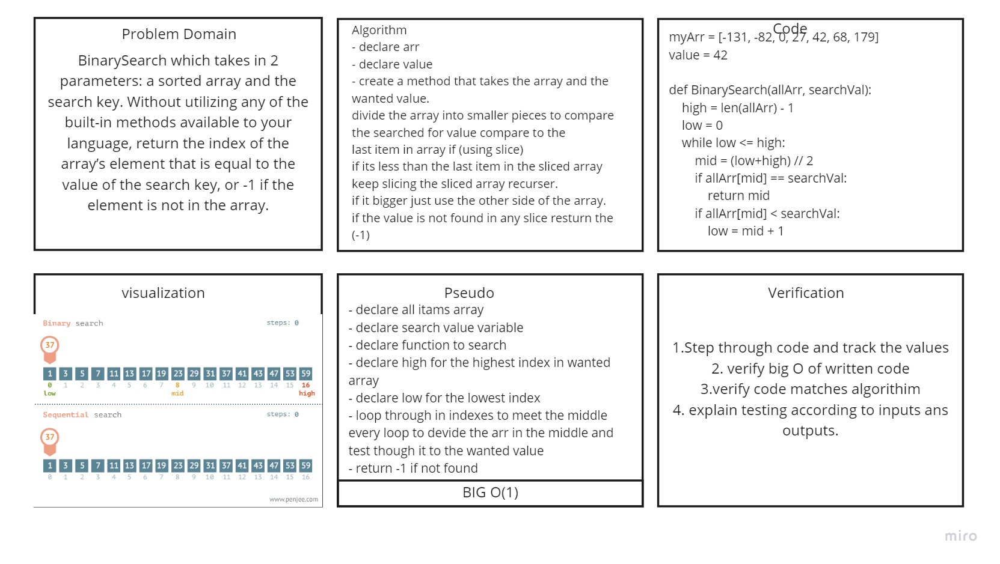

# array-binary-search

# Binary Search of Sorted Array
a function called BinarySearch which takes in 2 parameters: a sorted array and the search key. Without utilizing any of the built-in methods available to your language, return the index of the array’s element that is equal to the value of the search key, or -1 if the element is not in the array.

## Whiteboard Process

## Approach & Efficiency
create a method that takes the array and the
wanted value.
divide the array into smaller pieces to compare
the searched for value compare to the
last item in array if (using slice)
if its less than the last item in the sliced array
keep slicing the sliced array recurser.
if it bigger just use the other side of the array.
if the value is not found in any slice resturn the
(-1)
Big O Time--> O(Log n)
Big O space--> O(1)

--------------------------

