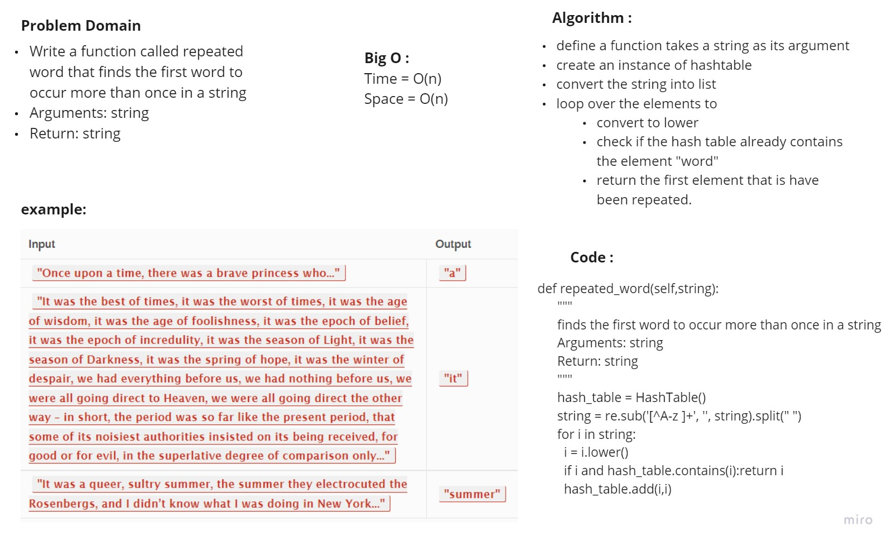

# Challenge Summary
<!-- Description of the challenge -->
https://github.com/HaneenHaashlamoun/data-structures-and-algorithms/pull/35

## Code Challenge: Class 31
- [x] Write a function called repeated word that finds the first word to occur more than once in a string
    - Arguments: string
    - Return: string

## Whiteboard Process
<!-- Embedded whiteboard image -->

## Approach & Efficiency
<!-- What approach did you take? Why? What is the Big O space/time for this approach? -->
Time = O(n)
Space = O(n)

## Solution
<!-- Show how to run your code, and examples of it in action -->
define a function takes a string as its argument
create an instance of hashtable
convert the string into list
loop over the elements to
convert to lower
check if the hash table already contains the element "word"
return the first element that is have been repeated.

---------------------------------------------------

# Hashtables

https://github.com/HaneenHaashlamoun/data-structures-and-algorithms/pull/33

## Features
- [x] add
    - Arguments: key, value
    - Returns: nothing
        This method should hash the key, and add the key and value pair to the table, handling collisions as needed.
- [x] get
    - Arguments: key
    - Returns: Value associated with that key in the table
- [x] contains
    - Arguments: key
    - Returns: Boolean, indicating if the key exists in the table already.
- [x] hash
    - Arguments: key
    - Returns: Index in the collection for that key

## Challenge

Implement a Hashtable Class with the following methods: add, get, contains and hash

## Approach & Efficiency

the approach taken in this code challenge is simply be creating a Hashtable class, with the init function to take the size parameter, in order to create proper buckets for the keys/values to be stored. then we have the add contains method, that checks if the key is inside the Hashtable, the add method is for adding value to the Hashtable, get method is for retrieving the value for a key when inserted, and returns a None if the key does not exist, and the final method is hash, which simply hashes the key, and return the index of where should this key/value pair should be saved at.

### Big O

Time complexity: O(1)
Space complexity: O(n)

## API

the methods that are used are listed below:

- add
- get
- contains
- hash
