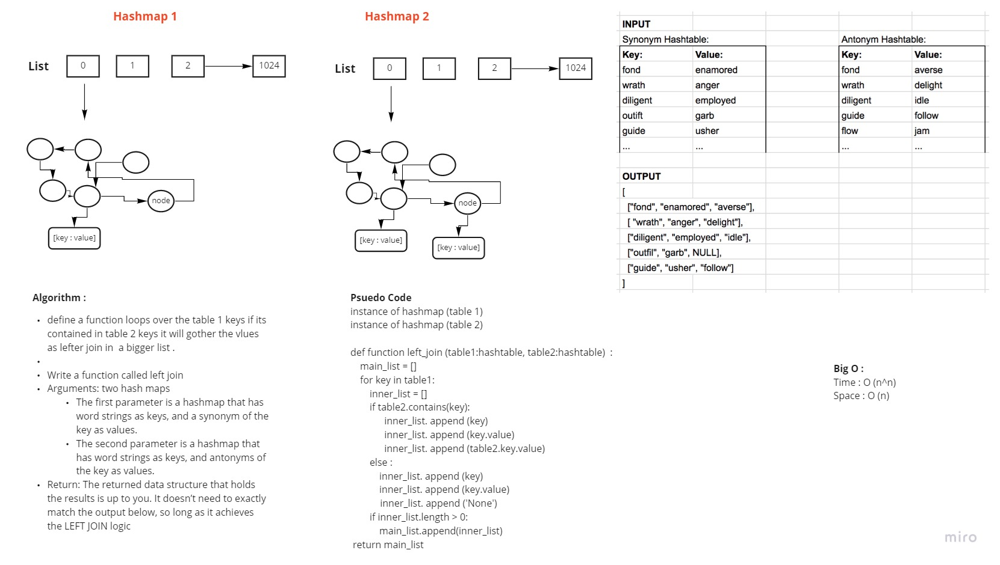

https://github.com/HaneenHaashlamoun/data-structures-and-algorithms/pull/37
# Hashmap LEFT JOIN
<!-- Short summary or background information -->
## Code Challenge: Class 33
### Implement a simplified LEFT JOIN for 2 Hashmaps.

## Challenge
<!-- Description of the challenge -->
### Feature Tasks
- [x] Write a function that LEFT JOINs two hashmaps into a single data structure.

- [x] Write a function called left join
- [x] Arguments: two hash maps
    - [x] The first parameter is a hashmap that has word strings as keys, and a synonym of the key as values.
    - [x] The second parameter is a hashmap that has word strings as keys, and antonyms of the key as values.
- [x] Return: The returned data structure that holds the results is up to you. It doesn’t need to exactly match the output below, so long as it achieves the LEFT JOIN logic

## Approach & Efficiency
<!-- What approach did you take? Why? What is the Big O space/time for this approach? -->
Big O :
Time : O (n^n)
Space : O (n)

## Solution
<!-- Embedded whiteboard image -->
define a function loops over the table 1 keys if its contained in table 2 keys it will gother the vlues as lefter join in  a bigger list .

### Girls Helped me :
 - *Dua Jaradat*
 - *Tasneem Al-Absi*
