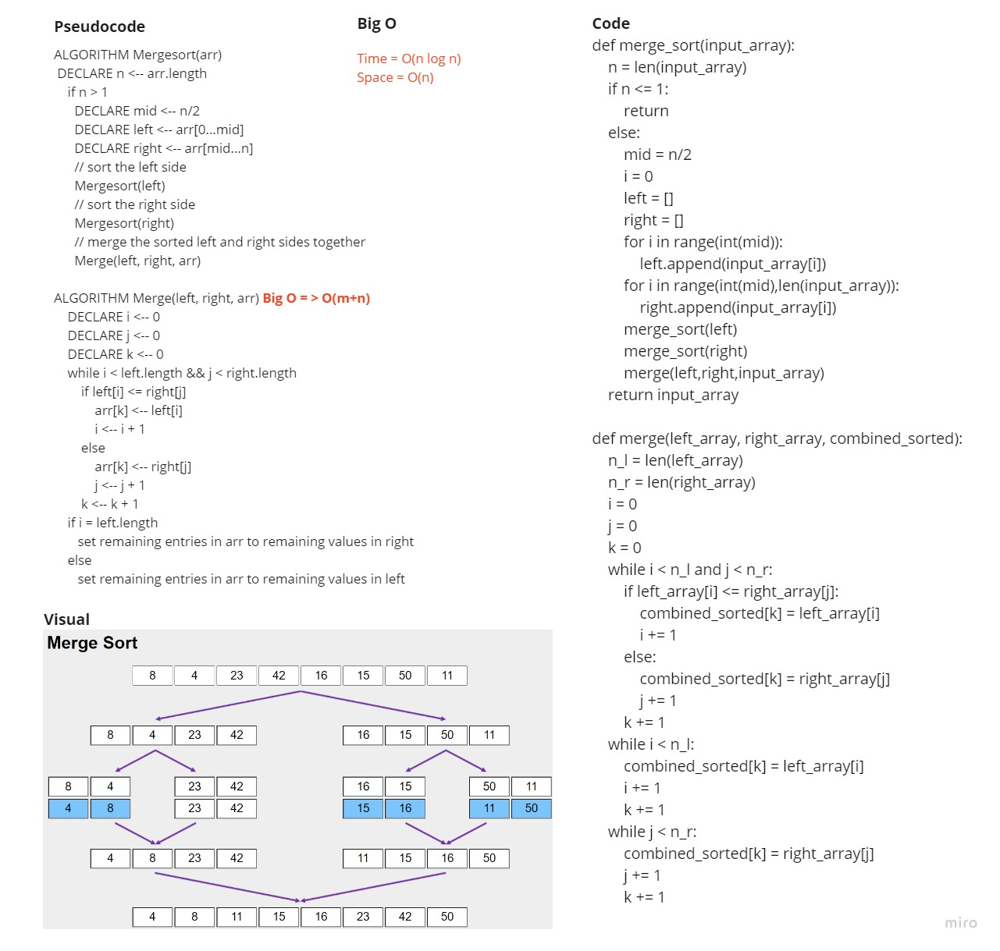

# Challenge Summary
<!-- Description of the challenge -->
https://github.com/HaneenHaashlamoun/data-structures-and-algorithms/pull/32

### Implementation
- [x] Provide a visual step through for each of the sample arrays based on the provided pseudo code
- [x] Convert the pseudo-code into working code in your language
- [x] Present a complete set of working tests

## Whiteboard Process
<!-- Embedded whiteboard image -->

## Approach & Efficiency
<!-- What approach did you take? Why? What is the Big O space/time for this approach? -->
- Time: O(n log n) 
- Space: O(n)

## Solution
<!-- Show how to run your code, and examples of it in action -->
used recursion to sort the devided pieces of the main inserted list