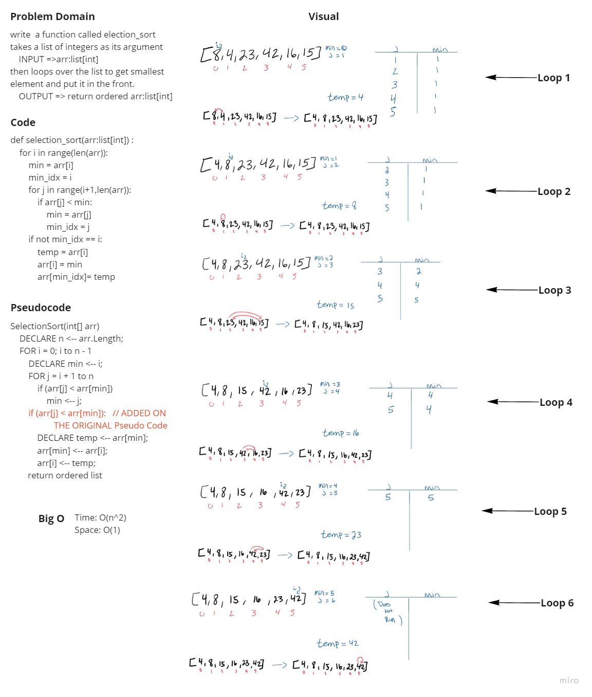

# Selection Sort

selection sort is an in-place comparison sorting algorithm. It has an O(n²) time complexity, which makes it inefficient on large lists, and generally performs worse than the similar insertion sort. (wikipedia)

**Efficiency**

- Worst complexity: n^2
- Average complexity: n^2
- Best complexity: n^2
- Space complexity: 1

## Pseudo Code
```
SelectionSort(int[] arr)
    DECLARE n <-- arr.Length;
    FOR i = 0; i to n - 1  
        DECLARE min <-- i;
        FOR j = i + 1 to n
            if (arr[j] < arr[min])
                min <-- j;

        DECLARE temp <-- arr[min];
        arr[min] <-- arr[i];
        arr[i] <-- temp;
```

## Implemented Code [tested]
```
def selection_sort(arr:list[int]) :    
    for i in range(len(arr)):
        min = arr[i]
        min_idx = i
        for j in range(i+1,len(arr)):
            if arr[j] < min:
                min = arr[j]
                min_idx = j      
        if not min_idx == i:
            temp = arr[i]
            arr[i] = min
            arr[min_idx]= temp
    return arr
```

## White Board:



