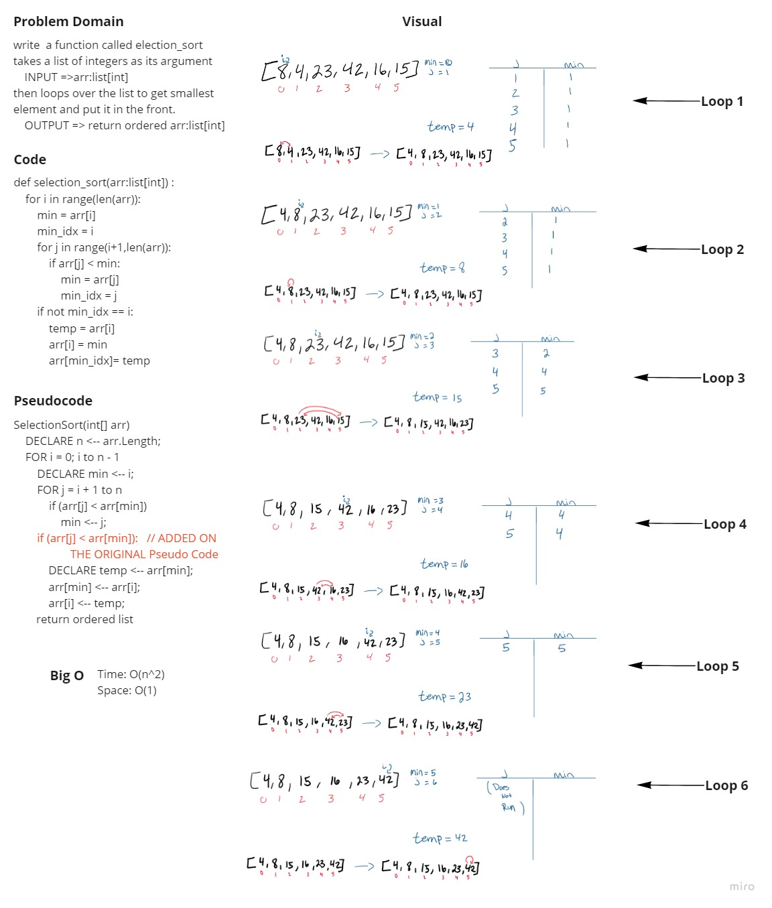

# Challenge Summary
<!-- Description of the challenge -->
https://github.com/HaneenHaashlamoun/data-structures-and-algorithms/pull/31

- [x] Top-level README “Table of Contents” is updated
 - [x] README for this challenge is complete
       - [x] Summary, Description, Approach & Efficiency, Solution
       - [x] Picture of whiteboard
       - [x] Link to code
 - [x] Feature tasks for this challenge are completed
 - [x] Unit tests written and passing
       - [x] “Happy Path” - Expected outcome

## Whiteboard Process
<!-- Embedded whiteboard image -->

## Approach & Efficiency
<!-- What approach did you take? Why? What is the Big O space/time for this approach? -->
- Time: O(n^2)
    - The basic operation of this algorithm is comparison. This will happen n * (n-1) number of times…concluding the algorithm to be n squared.
- Space: O(1)
    - No additional space is being created. This array is being sorted in place…keeping the space at constant O(1).

## Solution
<!-- Show how to run your code, and examples of it in action -->
nested for to loop over the input list to get smallest element and put it in the front.
