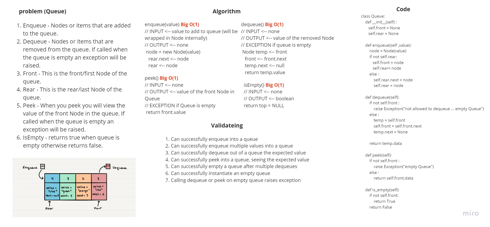
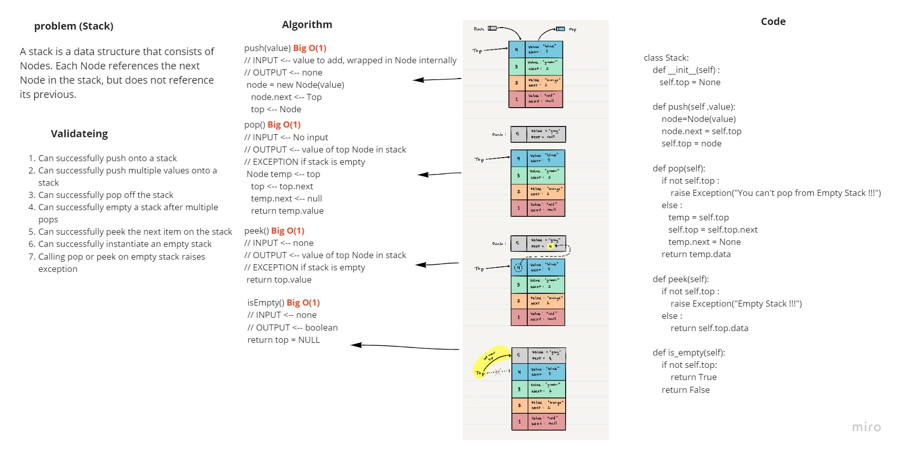

# Stacks and Queues
A stack is a data structure that consists of Nodes. Each Node references the next Node in the stack, but does not reference its previous.
A queue is a collection of objects that supports fast first-in, first-out (FIFO) semantics for inserts and deletes. The insert and delete operations sometimes called enqueue and dequeue. Unlike lists or arrays, queues typically don't allow for random access to the objects they contain.

https://github.com/HaneenHaashlamoun/data-structures-and-algorithms/pull/20

## Challenge

[**WHITEBOARDS**](https://miro.com/welcomeonboard/alRwREd1OGltcGV3OHd5VlNHamFXNmxMSlZMdDFDMGt6Q1FObllyMGRhczZDMTQwZFN2UHNBdnpvdmNBdDl0Q3wzMDc0NDU3MzYxOTIyMDQzMjYx?invite_link_id=645014362449)

<!-- Description of the challenge -->
[x] Can successfully push onto a stack

[x] Can successfully push multiple values onto a stack

[x] Can successfully pop off the stack

[x] Can successfully empty a stack after multiple pops

[x] Can successfully peek the next item on the stack

[x] Can successfully instantiate an empty stack

[x] Calling pop or peek on empty stack raises exception

[x] Can successfully enqueue into a queue

[x] Can successfully enqueue multiple values into a queue

[x] Can successfully dequeue out of a queue the expected value

[x] Can successfully peek into a queue, seeing the expected value

[x] Can successfully empty a queue after multiple dequeues

[x] Can successfully instantiate an empty queue

[x] Calling dequeue or peek on empty queue raises exception

## Approach & Efficiency
<!-- What approach did you take? Why? What is the Big O space/time for this approach? -->
OOP  Stacks and Queues
O(1) for each function

## API
<!-- Description of each method publicly available to your Stack and Queue-->
Stack:
 - push: adds a new node with that value to the top of the stack with an O(1) Time performance.
 - pop: Removes the node from the top of the stack
 -  peek: Returns value of the node located at the top of the stack
- 
- is_empty: Returns boolean shows if the stack is empty(true).

------------------

Queue:
- enqueue: adds a new node with that value to the rear of the queue with an O(1) Time performance.
- dequeue: Removes the node from the front of the queue
- peek: Returns value of the node from the front of the queue
- is_empty: Returns boolean shows if the stack is empty(true).
