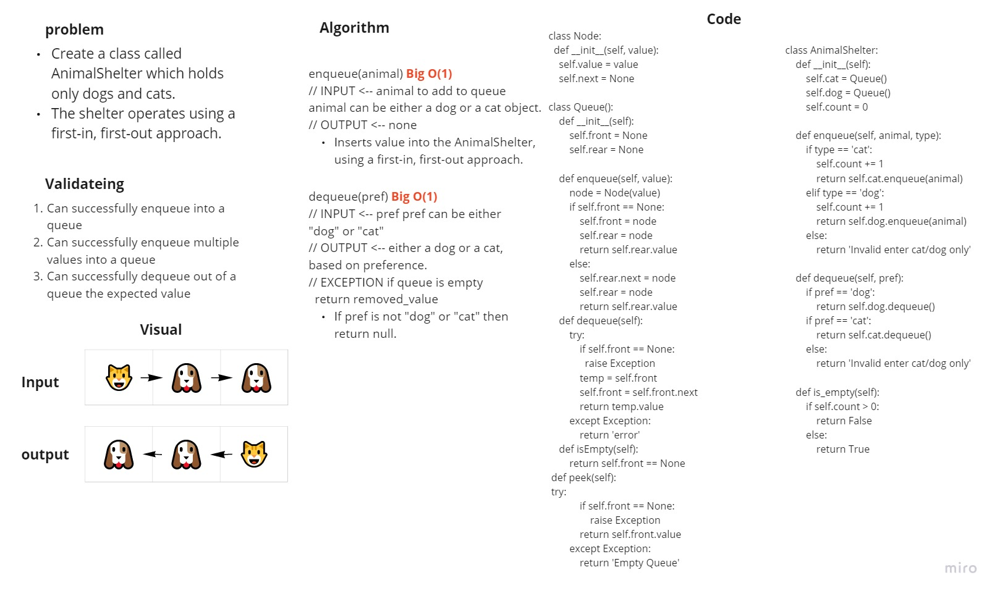

# Stacks and Queues - pseudo

Create a class called AnimalShelter which holds only dogs and cats.
The shelter operates using a first-in, first-out approach.
Implement the following methods:
    enqueue
        Arguments: animal
            animal can be either a dog or a cat object.
    dequeue
        Arguments: pref
            pref can be either "dog" or "cat"
            Return: either a dog or a cat, based on preference.
            If pref is not "dog" or "cat" then return null.

https://github.com/HaneenHaashlamoun/data-structures-and-algorithms/pull/22

## Challenge

[**WHITEBOARDS**](https://miro.com/welcomeonboard/alRwREd1OGltcGV3OHd5VlNHamFXNmxMSlZMdDFDMGt6Q1FObllyMGRhczZDMTQwZFN2UHNBdnpvdmNBdDl0Q3wzMDc0NDU3MzYxOTIyMDQzMjYx?invite_link_id=540779400838)

<!-- Description of the challenge -->
[x]Create a class called AnimalShelter which holds only dogs and cats.
[x]The shelter operates using a first-in, first-out approach.
[x]Implement the following methods:
    [x]enqueue
        Arguments: animal
            animal can be either a dog or a cat object.
    [x]dequeue
        Arguments: pref
            pref can be either "dog" or "cat"
            Return: either a dog or a cat, based on preference.
            If pref is not "dog" or "cat" then return null.

[x] Can successfully enqueue into a queue

[x] Can successfully enqueue multiple values (Stacks) into a queue

[x] Can successfully dequeue out of a queue (inner Stack) the expected value

[x] Calling dequeue on empty queue raises exception

## Approach & Efficiency
<!-- What approach did you take? Why? What is the Big O space/time for this approach? -->
using a first-in, first-out approach, OOP on nodes and queues

Big O(1) for each function

## API
<!-- Description of each method publicly available to your Stack and Queue-->
Queue:
- enqueue: adds a new node with that value (new Stack1) to the rear of the queue with an O(1) Time performance.
- dequeue: Removes the node from the front of the queue
- is_empty: Returns boolean shows if the stack is empty(true).
