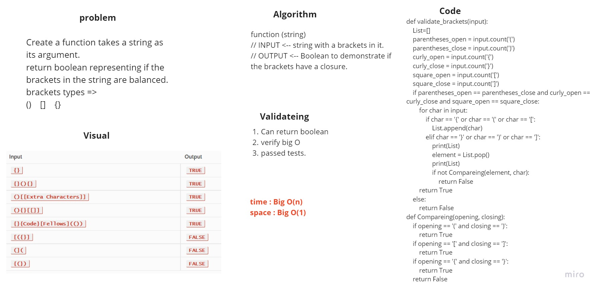

# Stacks and Queues - brackets

## Multi-bracket Validation.

https://github.com/HaneenHaashlamoun/data-structures-and-algorithms/pull/23

## Challenge

[**WHITEBOARDS**](https://miro.com/welcomeonboard/alRwREd1OGltcGV3OHd5VlNHamFXNmxMSlZMdDFDMGt6Q1FObllyMGRhczZDMTQwZFN2UHNBdnpvdmNBdDl0Q3wzMDc0NDU3MzYxOTIyMDQzMjYx?invite_link_id=540779400838)

<!-- Description of the challenge -->
- [x] Write a function called validate brackets
        Arguments: string
        Return: boolean
            - representing whether or not the brackets in the string are balanced

There are 3 types of brackets:
    - Round Brackets : ()
    - Square Brackets : []
    - Curly Brackets : {}

## Approach & Efficiency
<!-- What approach did you take? Why? What is the Big O space/time for this approach? -->
using a first-in, first-out approach.

Big O(n) 

## Solution
<!-- Description of each method publicly available to your Stack and Queue-->
Create a function takes a string as its argument.
return boolean representing if the brackets in the string have closure.
