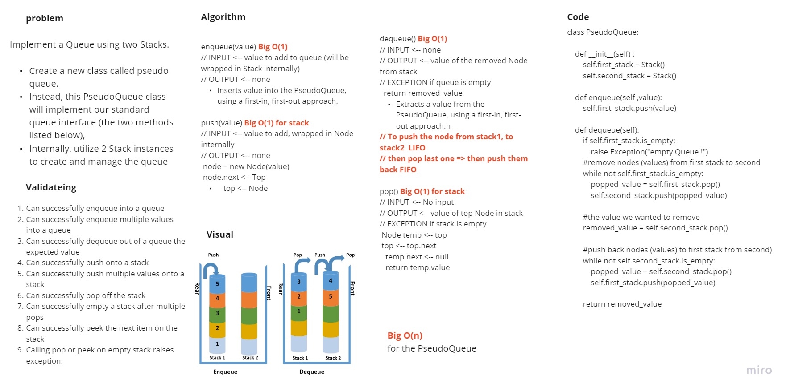

# Stacks and Queues - pseudo
Implement a Queue using two Stacks.

Create a new class called pseudo queue.
Instead, this PseudoQueue class will implement our standard queue interface (the two methods listed below),
Internally, utilize 2 Stack instances to create and manage the queue

https://github.com/HaneenHaashlamoun/data-structures-and-algorithms/pull/21

## Challenge

[**WHITEBOARDS**](https://miro.com/welcomeonboard/alRwREd1OGltcGV3OHd5VlNHamFXNmxMSlZMdDFDMGt6Q1FObllyMGRhczZDMTQwZFN2UHNBdnpvdmNBdDl0Q3wzMDc0NDU3MzYxOTIyMDQzMjYx?invite_link_id=540779400838)

<!-- Description of the challenge -->
[x] Can successfully push onto a stack

[x] Can successfully pop off the stack

[x] Can successfully instantiate an empty stack

[x] Calling pop on empty stack raises exception

[x] Can successfully enqueue into a queue

[x] Can successfully enqueue multiple values (Stacks) into a queue

[x] Can successfully dequeue out of a queue (inner Stack) the expected value

[x] Calling dequeue on empty queue raises exception

## Approach & Efficiency
<!-- What approach did you take? Why? What is the Big O space/time for this approach? -->
using a first-in, first-out approach, OOP on nodes and queues with stacks.

O(1) for each function
O(n) for the dequeue of the queue using stack.

## API
<!-- Description of each method publicly available to your Stack and Queue-->
Stack:
 - push: adds a new node with that value to the top of the stack with an O(1) Time performance.
 - pop: Removes the node from the top of the stack
 - is_empty: Returns boolean shows if the stack is empty(true).
------------------

Queue:
- enqueue: adds a new node with that value (new Stack1) to the rear of the queue with an O(1) Time performance.
- dequeue: Removes the node from the front of the queue
- is_empty: Returns boolean shows if the stack is empty(true).
