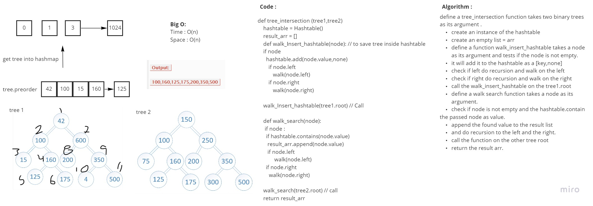

# Challenge Summary
<!-- Description of the challenge -->
https://github.com/HaneenHaashlamoun/data-structures-and-algorithms/pull/36

# Specifications

Python: a folder named tree_intersection which contains a file called tree_intersection.py

- [x] Write a function called tree_intersection that takes two binary trees as parameters.
- [x] Using your Hashmap implementation as a part of your algorithm, return a set of values found in both trees.

## Whiteboard Process
<!-- Embedded whiteboard image -->

## Approach & Efficiency
<!-- What approach did you take? Why? What is the Big O space/time for this approach? -->
Big O:
Time : O(n)
Space : O(n)

## Solution
<!-- Show how to run your code, and examples of it in action -->
used recurion to go over the elements of the hashmap and append the occuerances to list and return it

### Girls Helped me :
 - *Dua Jaradat*
 - *Tahani Ali*
 - *Tasneem Al-Absi*
 - *Mona Saleh*
