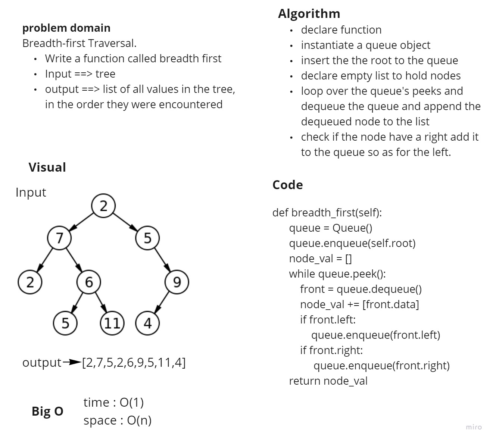
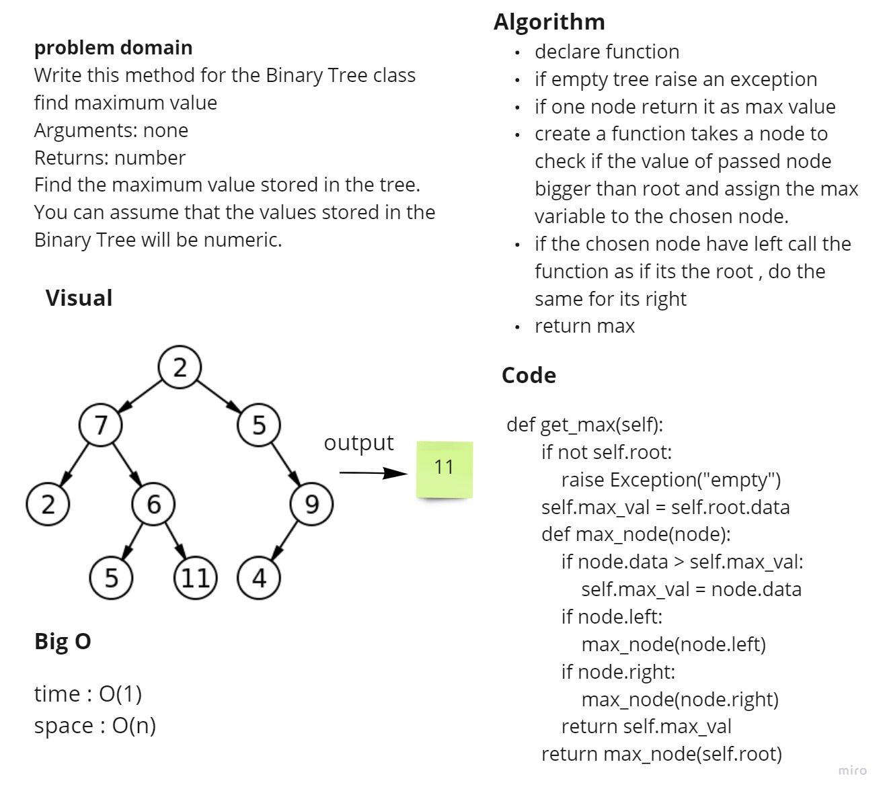

# Challenge Summary
<!-- Description of the challenge -->
https://github.com/HaneenHaashlamoun/data-structures-and-algorithms/pull/29

- [x] Write a function called breadth first
    Arguments: tree
    Return: list of all values in the tree, in the order they were encountered

## Whiteboard Process
<!-- Embedded whiteboard image -->

## Approach & Efficiency
<!-- What approach did you take? Why? What is the Big O space/time for this approach? -->
function breadth_first return tree nodes as tree

time : O(n)
space : O(n)

==============================================================================

# Challenge Summary
<!-- Description of the challenge -->
https://github.com/HaneenHaashlamoun/data-structures-and-algorithms/pull/28

- [x] Write this method for the Binary Tree class
find maximum value
    Arguments: none
    Returns: number
- [x] Find the maximum value stored in the tree.
    You can assume that the values stored in the Binary Tree will be numeric.

## Whiteboard Process
<!-- Embedded whiteboard image -->

## Approach & Efficiency
<!-- What approach did you take? Why? What is the Big O space/time for this approach? -->
**recursion**
time : O(n)
space : O(1)

==============================================================================

# Challenge Summary
https://github.com/HaneenHaashlamoun/data-structures-and-algorithms/pull/25

<!-- Description of the challenge -->
# Implementation: Trees

## Feature Tasks
### Node
- Create a Node class that has properties for the value stored in the node, the left child node, and the right child node.

### Binary Tree
- Create a Binary Tree class
- Define a method for each of the depth first traversals:
    - pre order
    - in order
    - post order which returns an array of the values, ordered appropriately.
- Any exceptions or errors that come from your code should be semantic, capture-able errors. For example, rather than a default error thrown by your language, your code should raise/throw a custom, semantic error that describes what went wrong in calling the methods you wrote for this lab.

### Binary Search Tree
- Create a Binary Search Tree class
    This class should be a sub-class (or your languages equivalent) of the Binary Tree Class, with the following additional methods:
    - Add : Adds a new node with that value in the correct location in the binary search tree.
    - Contains : Returns: boolean indicating whether or not the value is in the tree at least once.

## Approach & Efficiency
<!-- What approach did you take? Why? What is the Big O space/time for this approach? -->
pre order : O(n)
in order : O(n)
post order : O(n)
add : O(logN)
contains : O(logN)
