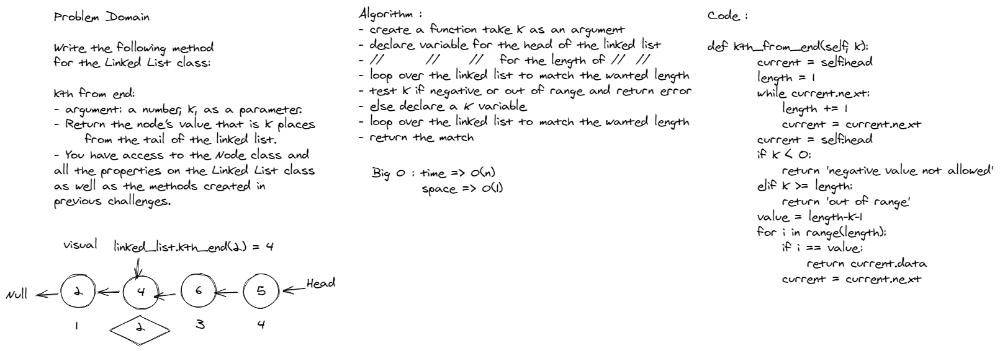
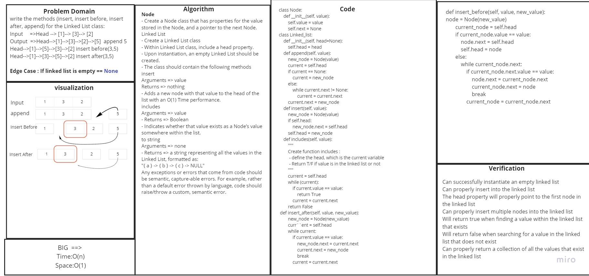

# Code Chalenge 7: linked-list-kth
<!-- Short summary or background information -->
https://github.com/HaneenHaashlamoun/data-structures-and-algorithms/pull/26

**Specifications**
- [x] Write the following method for the Linked List class:
        
    - [x] kth from end
        -  argument: a number, k, as a parameter.
        -  Return the node’s value that is k places from the tail of the linked list.
            - [x] You have access to the Node class and all the properties on the Linked List class as well as the methods created in previous challenges.

## Challenge
<!-- Description of the challenge -->

## Approach & Efficiency
<!-- What approach did you take? Why? What is the Big O space/time for this approach? -->
loop to get the length of linked list ,and if condition to find the node that matched the given k

--------------------------------------------------------------------

# Code Chalenge 6: Singly Linked List
<!-- Short summary or background information -->
https://github.com/HaneenHaashlamoun/data-structures-and-algorithms/pull/23

**Specifications**

[x] Read all of these instructions carefully.

[x] Name things exactly as described.

[x] Do all your work in a your data-structures-and-algorithms public repository.

[x] Create a new branch in your repo named as noted below.

[x] Follow the language-specific instructions for the challenge type listed below.

[x] Update the “Table of Contents” - in the README at the root of the repository - with a link to this challenge’s README file.

## Challenge
<!-- Description of the challenge -->

## Approach & Efficiency
<!-- What approach did you take? Why? What is the Big O space/time for this approach? -->
Classes and methods , nodes and and linked lists.
| Method | Time | Space |
| ----------- | ----------- | ------------- |
| Insert | O(1) | O(1) |
| Includes | O(n) | O(1) |
| Print | O(n) | O(1) |
