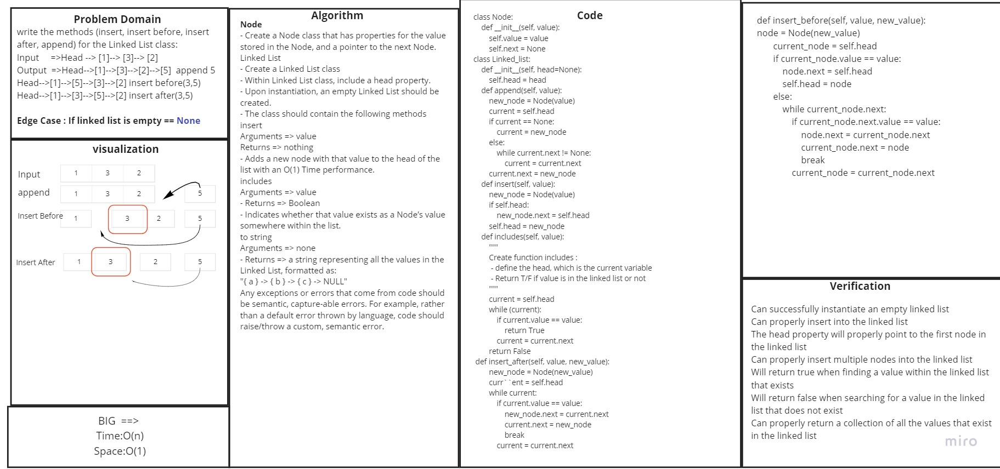

# Singly Linked List
<!-- Short summary or background information -->
https://github.com/HaneenHaashlamoun/data-structures-and-algorithms/pull/18

**Specifications**
[x] Read all of these instructions carefully.

[x] Name things exactly as described.

[x] Do all your work in a your data-structures-and-algorithms public repository.

[x] Create a new branch in your repo named as noted below.

[x] Follow the language-specific instructions for the challenge type listed below.

[x] Update the “Table of Contents” - in the README at the root of the repository - with a link to this challenge’s README file.

## Challenge
<!-- Description of the challenge -->

## Approach & Efficiency
<!-- What approach did you take? Why? What is the Big O space/time for this approach? -->
Classes and methods , nodes and and linked lists.